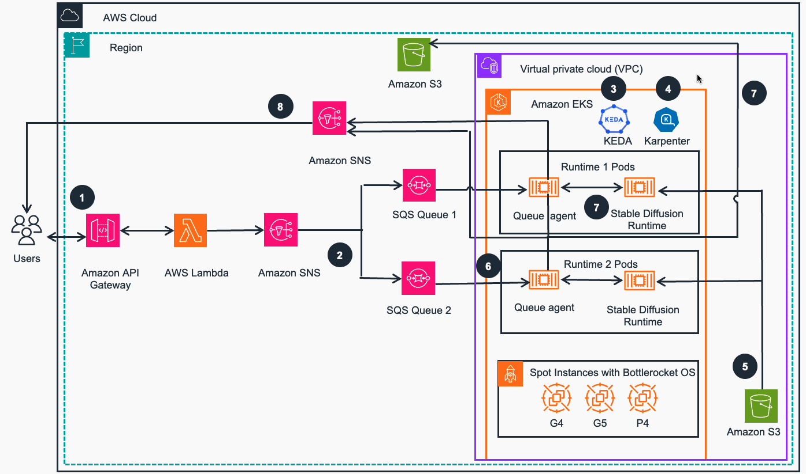

# Guidance for Asynchronous Inference with Stable Diffusion on AWS

Implementing a fast scaling and low cost Stable Diffusion inference solution with serverless and containers on AWS

[Stable Diffusion](https://aws.amazon.com/what-is/stable-diffusion/) is a popular open source project for generating images using Generative AI. Building a scalable and cost efficient Machine Learning (ML) Inference solution is a common challenge that many AWS customers are facing.
This project shows how to use serverless architcture and container services to build an end-to-end low cost, rapidly scaling asyncronous image generation architecture. This repo contains the sample code and CDK deployment scripts that will help you to deploy this solution in a few steps.

## Features

- Asyncronous API and [Serverless Event-Driven Architecture](https://docs.aws.amazon.com/wellarchitected/latest/serverless-applications-lens/event-driven-architectures.html)
- Image Generation with open source Stable Diffusion runtimes running on [Amazon EKS](https://aws.amazon.com/eks)
- Automatic [Amazon SQS](https://aws.amazon.com/sqs/) queue length based scaling with [KEDA](https://keda.sh/)
- Automatic provisioning of EC2 instances for Amazon EKS compute Nodes with [Karpenter](https://karpenter.sh/)
- Scaling up new Amazon EKS nodes within 2 minutes to run Inference tasks
- Saving up to 70% with [AWS GPU](https://aws.amazon.com/ec2/instance-types/g5/) spot EC2 instances

## Architecture diagram

<!-- img src="./low-latency-high-bandwidth-updated-architecture.jpg" width="90%" -->

 
Figure 1: Asynchronous Image Generation with Stable Diffusion on AWS reference architecture

### Architecture steps

1. An application sends the prompt to [Amazon API Gateway](https://aws.amazon.com/api-gateway/) that acts as an endpoint for the overall Guidance, including authentication. [AWS Lambda](https://aws.amazon.com/lambda/) function validates the requests, publishes them to the designated [Amazon Simple Notification Service](https://aws.amazon.com/sns/) (Amazon SNS) topic, and immediately returns a response.
2. Amazon SNS publishes the message to [Amazon Simple Queue Service](https://aws.amazon.com/sqs/) (Amazon SQS) queues. Each message contains a Stable Diffusion (SD) runtime name attribute and will be delivered to the queues with matching SD runtime.
3. In the [Amazon Elastic Kubernetes Service](https://aws.amazon.com/eks/) (Amazon EKS) cluster, the previously deployed open source [Kubernetes Event Driven Auto-Scaler (KEDA)](https://keda.sh) scales up new pods to process the incoming messages from SQS model processing queues.
4. In the Amazon EKS cluster, the previously deployed open source Kubernetes auto-scaler, [Karpenter](https://karpenter.sh), launches new compute nodes based on GPU [Amazon Elastic Compute Cloud](https://aws.amazon.com/ec2/) (Amazon EC2) instances (such as g4, g5, and p4) to schedule pending pods. The instances use pre-cached SD Runtime images and are based on [Bottlerocket OS](https://aws.amazon.com/bottlerocket/) for fast boot. The instance can be launched with on-demand or [spot](https://aws.amazon.com/ec2/spot) pricing model.
5. Stable Diffusion Runtimes load ML model files from [Amazon Simple Storage Service](https://aws.amazon.com/efs/) (Amazon S3) via [Mountpoint for Amazon S3 CSI Driver](https://github.com/awslabs/mountpoint-s3-csi-driver) on runtime initialization or on demand.
6. Queue agents (software component created for this Guidance) receive messages from SQS model processing queues and convert them to inputs for SD Runtime APIs calls.
7. Queue agents call SD Runtime APIs, receive and decode responses, and save the generated images to designated Amazon S3 buckets.
8. Queue agents send notifications to the designated SNS topic from the pods,  user receives notifications from SNS and can access images in S3 buckets.

### AWS services in this Guidance

| **AWS service**  | Description |
|-----------|------------|
|[Amazon Elastic Kubernetes Service - EKS](https://aws.amazon.com/eks/)|Core service -  application platform host the SD containerized workloads|
|[Amazon Virtual Private Cloud - VPC](https://aws.amazon.com/vpc/)| Core Service - network security layer |
|[Amazon Elastic Compute Cloud - EC2](https://aws.amazon.com/ec2/)| Core Service - EC2 instance power On Demand and Spot based EKS compute node groups for running container workloads|
|[Amazon Elastic Container Registry - ECR](https://aws.amazon.com/ecr/)|Core service - ECR registry is used to host the container images and Helm charts|
|[Amazon Simple Storage Service S3](https://aws.amazon.com/s3/)|Core service - Object storage for users' ETL assets from GitHub and Model files|
|[Amazon API Gateway](https://aws.amazon.com/api-gateway/)| Core service - endpoint for all user requests|
|[AWS Lambda](https://aws.amazon.com/lambda/)| Core service - validates the requests, publishes them to the designated queues |
|[Amazon Simple Queue Service](https://aws.amazon.com/sqs/)| Core service - provides asynchronous event handling |
|[Amazon Simple Notification Service](https://aws.amazon.com/sns/)| Core service - provides model specific event processing  |
|[Amazon CloudWatch](https://aws.amazon.com/cloudwatch/)|Auxiliary service - provides observability for core services  |
|[AWS CDK](https://aws.amazon.com/cdk/) |	Core service - Used for deploying and updating this solution|

### Cost

You are responsible for the cost of the AWS services used while running this Guidance. As of April 2024, the cost for running this
Guidance with the default settings in the US West (Oregon) is approximately for one month and generating one million images would cost approximately **$436.72** (excluding free tiers).

We recommend creating a [budget](https://docs.aws.amazon.com/cost-management/latest/userguide/budgets-create.html) through [AWS Cost Explorer](http://aws.amazon.com/aws-cost-management/aws-cost-explorer/) to help monitor and manage costs. Prices are subject to change. For full details, refer to the pricing webpage for each AWS service used in this Guidance.

The main services and their pricing for usage related to the number of images are listed below (per one million images):

| **AWS Service**  | **Billing Dimension** | **Quantity per 1M Images** | **Unit Price \[USD\]** | **Total \[USD\]** |
|-----------|------------|------------|------------|------------|
| Amazon EC2 | g5.2xlarge instance, Spot instance per hour  | 416.67 | \$ 0.4968 | \$ 207 |
| Amazon API Gateway | Per 1M REST API requests  | 1 | \$ 3.50 | \$ 3.50 |
| AWS Lambda | Per GB-second  | 12,50 | \$ 0.0000166667 | \$ 0.21 |
| AWS Lambda | Per 1M requests  | 1 | \$ 0.20 | \$ 0.20 |
| Amazon SNS | Per 1M requests  | 2 | \$ 0.50 | \$ 0.50 |
| Amazon SNS | Data transfer per GB  | 7.62\**  | \$ 0.09 | \$ 0.68 |
| Amazon SQS | Per 1M requests  | 2 | \$ 0.40 | \$ 0.80 |
| Amazon S3 | Per 1K PUT requests  | 2,000 | \$ 0.005 | \$ 10.00 |
| Amazon S3 | Per GB per month  | 143.05\*** | \$ 0.023 | \$ 3.29 |
| **Total, 1M images** | &nbsp; | &nbsp; | &nbsp; | **\$226.18** |

The fixed costs unrelated to the number of images, with the main services and their pricing listed below (per month):

| **AWS Service**  | Billing Dimension | Quantity per Month | Unit Price \[USD\] | Total \[USD\]
|-----------|------------|------------|------------|------------|
| Amazon EKS | Cluster  | 1 | \$ 72.00 | \$ 72.00 |
| Amazon EC2 | m5.large instance, On-Demand instance per hour  | 1440 | \$ 0.0960 | \$ 138.24 |
| **Total, month** | &nbsp; | &nbsp; | &nbsp; | **\$210.24** |

- \* Calculated based on an average request duration of 1.5 seconds and the average Spot instance pricing across all Availability Zones in the US West (Oregon) Region from January 29, 2024, to April 28, 2024.
- \*\* Calculated based on an average request size of 16 KB
- \*\*\* Calculated based on an average image size of 150 KB, stored for 1 month.

Please note that thise are estimated costs for reference only. The actual cost may vary depending on the model you use, task parameters, current Spot instance pricing, and other factors.

## Deployment Documentation

Please see detailed Implementation Guides here: 
- [English](https://aws-solutions-library-samples.github.io/aiml/asynchronous-image-generation-with-stable-diffusion-on-aws.html)
- [Chinese 简体中文 ](https://aws-solutions-library-samples.github.io/aiml/asynchronous-image-generation-with-stable-diffusion-on-aws-zh.html)
  
## Security

See [CONTRIBUTING](CONTRIBUTING.md#security-issue-notifications) for more information.

## License

This library is licensed under MIT-0 License. See the [LICENSE](LICENSE) file.
