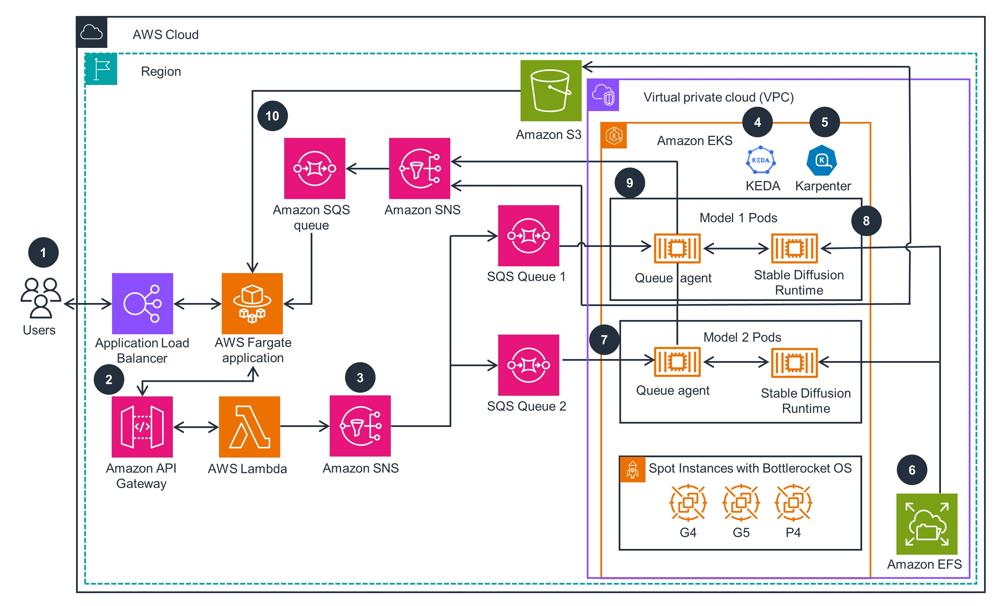

# Guidance for asynchronous inference with Stable Diffusion-Web UI on AWS

Implementing a fast scaling and low cost Stable Diffusion inference solution with serverless and containers on AWS

Stable Diffusion is a popular open source project for generating images using Gen AI. Building a scalable and cost efficient inference solution is a common challenge AWS customers facing. This project shows how to use serverless and container services to build an end-to-end low cost and fast scaling asyncronous image generation architecture. This repo contains the sample code and CDK deployment scripts, helping you to deploy this solution in a few steps.

## Features

- Asyncronous API and Serverless Event-Driven Architecture
- Image Generation with Stable Diffusion Web UI on Amazon EKS
- Automatic queue length based scaling with KEDA
- Automatic provisioning ec2 instances with Karpenter
- Scaling up new inference nodes within 2 minutes
- Saving up to 70% with GPU spot instances

## Architecture diagram
<!--  -->
<!-- img src="./low-latency-high-bandwidth-updated-architecture.jpg" width="90%" --> 

 
Figure 1: Guidance for Asynchronous Image Generation with Stable Diffusion on AWS architecture

### Architecture steps

1. Users send prompts to an application running on [AWS ECS Fargate](https://aws.amazon.com/fargate/) through an [Application Load Balancing](https://aws.amazon.com/elasticloadbalancing/application-load-balancer/) endpoint.
2. An application sends prompt to [Amazon API Gateway](https://aws.amazon.com/api-gateway/) that acts as an endpoint for the overall solution, including authentication. [AWS Lambda](https://aws.amazon.com/lambda/) function validates the requests, publishes them to the designated [Amazon Simple Notification Service](https://aws.amazon.com/sns/) (Amazon SNS) topic, and immediately returns a response.
3. Amazon SNS publishes the message to [Amazon Simple Queue Service](https://aws.amazon.com/sqs/) (Amazon SQS) queues. Each message contains a [Stable Diffusion](https://github.com/AUTOMATIC1111/stable-diffusion-webui) (SD) model name attribute and will be delivered to the queues with matching SD model names.
4. In the [Amazon Elastic Kubernetes Service](https://aws.amazon.com/eks/) (Amazon EKS) cluster, the previously deployed open source Kubernetes Event Driven Auto-Scaler (KEDA) scales up new pods to process the incoming messages from SQS model processing queues.
5. In the Amazon EKS cluster, Karpenter, an open source Kubernetes compute auto-scaler, launches new compute nodes based on GPU [Amazon Elastic Compute Cloud](https://aws.amazon.com/ec2/) (Amazon EC2) Spot instances (such as G4, G5, and P4) to schedule pending pods. The instances use pre-cached SD Runtime images and are based on [Bottlerocket OS](https://aws.amazon.com/bottlerocket/) for fast boot.
6. Stable Diffusion Runtimes load ML model files from [Amazon Elastic File System](https://aws.amazon.com/efs/) (Amazon EFS) file system upon pod initializations.
7. Queue agents (a program created for this Guidance) receive messages from SQS model processing queues and convert them to inputs for SD Runtime APIs calls.
8. Queue agents call SD Runtime APIs, receive and decode responses, and save the generated images to [Amazon Simple Storage Service](https://aws.amazon.com/s3/) (Amazon S3) buckets.
9. Queue agents send notifications to the designated SNS topic from the pods and the application receives notifications from the corresponding SQS queue.
10. An application running on [AWS Fargate](https://aws.amazon.com/fargate/) downloads the generated images from the S3 bucket and renders them to users.

### AWS services in this Guidance

- [Amazon Elastic Kubernetes Service (EKS)](https://aws.amazon.com/eks/)
- [Amazon Elastic Container Registry](https://aws.amazon.com/ecr/)
- [AWS Fargate](https://aws.amazon.com/fargate/)
- [Amazon API Gateway](https://aws.amazon.com/api-gateway/)
- [AWS Lambda](https://aws.amazon.com/lambda/)
- [Amazon Simple Queue Service](https://aws.amazon.com/sqs/)
- [Amazon Simple Notification Service](https://aws.amazon.com/sns/)
- [Amazon Elastic File System](https://aws.amazon.com/efs/)
- [Amazon Simple Storage Service](https://aws.amazon.com/s3/)

## Documentation

Check out our [live docs](https://aws-samples.github.io/stable-diffusion-on-eks/en/)!

## Security

See [CONTRIBUTING](CONTRIBUTING.md#security-issue-notifications) for more information.

## License

This library is licensed under MIT-0 License. See the [LICENSE](LICENSE) file.
